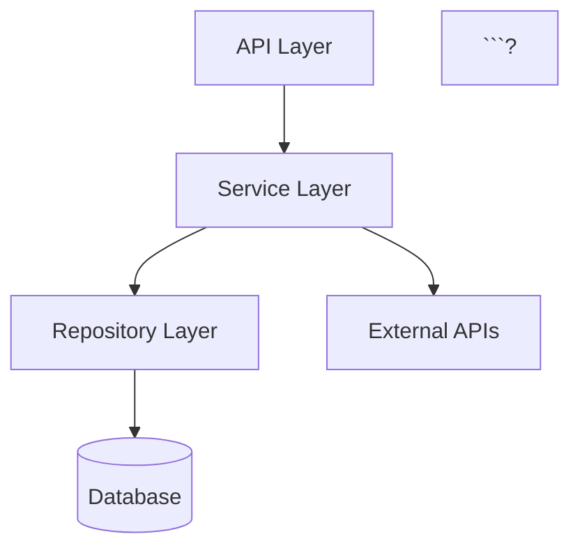

# Documentation Generation — Execution Plan

> **Date**: 2026  
> **Goal**: Auto-generate comprehensive, accurate, and beautiful documentation for any indexed codebase  
> **Current State**: Basic doc generation exists (README, Architecture, Module, Flow, Runbook) with deterministic + LLM enrichment  
> **Target**: Production-grade documentation engine that produces docs rivaling hand-written ones

---

## Current State Assessment

### What We Have

| Component | Status | Quality |
|-----------|--------|---------|
| 5 doc types (README, Architecture, Module, Flow, Runbook) | ? Working | Basic templates |
| Deterministic generator (`generator.py`) | ? Working | Factual, covers graph data |
| LLM enrichment (optional) | ? Working | Adds narration/explanation |
| Markdown renderer (`renderer.py`) | ? Working | Simple output |
| Citation system (links back to source) | ? Working | Basic |
| DB persistence (`GeneratedDoc` model) | ? Working | Stores output |
| API endpoints (generate, list, get) | ? 3 endpoints | Functional |

### What's Missing

| Gap | Impact | Priority |
|-----|--------|----------|
| No incremental regeneration | Full regen on every change | P0 |
| No diff-aware docs | Can't show "what changed" | P0 |
| No API reference generation | No auto-generated API docs | P0 |
| No dependency documentation | No dep graph docs | P1 |
| No onboarding guide generation | New devs have no auto-guide | P1 |
| No diagram embedding | Docs have no visual diagrams | P1 |
| No multi-format output | Only Markdown, no HTML/PDF/Docusaurus | P1 |
| No doc quality scoring | No way to know if docs are good | P2 |
| No doc versioning/history | Can't diff docs between versions | P2 |
| No custom templates | Users can't customize doc layout | P2 |
| No webhook/CI integration | Docs not auto-regenerated on push | P2 |
| No cross-repo documentation | Can't document a multi-repo system | P3 |

---

## Execution Plan

### Phase 1: Enhanced Doc Types & Content Quality (8h) ? DONE

**Goal**: Produce significantly richer documentation content.

#### 1.1 API Reference Generator

Auto-generate API documentation from symbols:

```python
class DocType(enum.StrEnum):
    README = "readme"
    ARCHITECTURE = "architecture"
    MODULE = "module"
    FLOW = "flow"
    RUNBOOK = "runbook"
    API_REFERENCE = "api_reference"     # NEW
    ONBOARDING = "onboarding"           # NEW
    CHANGELOG = "changelog"             # NEW
    DEPENDENCY_MAP = "dependency_map"   # NEW
```

**API Reference** output structure:
```markdown
# API Reference: auth module

## Classes

### `AuthService`
Authentication service handling OAuth and JWT flows.

#### Methods

##### `authenticate(token: str) -> User`
Validate a JWT token and return the authenticated user.

- **Parameters**: `token` (str) — Bearer token from Authorization header
- **Returns**: `User` — Authenticated user object
- **Raises**: `HTTPException(401)` — If token is invalid/expired
- **Source**: [`app/auth/service.py#L45-L62`](app/auth/service.py#L45-L62)

##### `create_token(user_id: str) -> str`
...
```

#### 1.2 Onboarding Guide Generator

Auto-generate "Getting Started" docs:
- Entry points detected from main/app files
- Setup steps inferred from config, env vars, Dockerfile
- Key flows traced from entry point to database
- "Where to find things" section from module structure

#### 1.3 Changelog Generator (diff-based)

Compare two snapshots and generate:
- New files/modules added
- Changed public APIs (signature changes, new methods)
- Removed symbols
- Breaking changes (removed public functions)
- New dependencies

```python
async def generate_changelog(
    db: AsyncSession,
    snapshot_id: str,
    previous_snapshot_id: str,
    *,
    llm: LLMClient | None = None,
) -> GeneratedDocument:
```

#### 1.4 Dependency Map Document

Auto-generate dependency documentation:
- External dependencies (from imports/requirements)
- Internal module dependencies (from call graph)
- Circular dependency warnings
- Dependency version info (if available from SBOM)

#### Deliverables
- 4 new generator functions in `generator.py`
- 4 new template definitions in `templates.py`
- Updated `orchestrator.py` to support new types
- New API endpoint: `POST /repos/{id}/snapshots/{sid}/docs/changelog?previous={prev_sid}`
- 20+ tests

---

### Phase 2: Diagram Embedding (6h)

**Goal**: Auto-generate and embed diagrams in documentation.

#### 2.1 Mermaid Diagram Generation

Convert existing graph data to Mermaid syntax:

```python
class DiagramType(enum.StrEnum):
    CLASS_DIAGRAM = "classDiagram"
    SEQUENCE = "sequenceDiagram"
    FLOWCHART = "flowchart"
    DEPENDENCY_GRAPH = "graph"
    ER_DIAGRAM = "erDiagram"
```

```markdown
## Architecture



#### 2.2 Integration with Doc Types

| Doc Type | Diagrams Included |
|----------|-------------------|
| Architecture | Module dependency graph, layer diagram |
| Module | Class diagram for module, call graph |
| Flow | Sequence diagram of the flow |
| API Reference | Endpoint flow diagram |
| Dependency Map | Full dependency graph |

#### 2.3 Diagram Simplification

For large codebases, auto-simplify:
- Collapse modules with <3 public symbols into single nodes
- Show top-N callers/callees only
- Group by package/directory
- Maximum 25 nodes per diagram (configurable)

#### Deliverables
- New module: `app/docgen/diagrams.py`
- Mermaid generators for 5 diagram types
- Auto-simplification logic
- Embedded in all doc types during rendering
- 15+ tests

---

### Phase 3: Multi-Format Output (5h)

**Goal**: Generate docs in multiple formats beyond Markdown.

#### 3.1 Output Formats

```python
class OutputFormat(enum.StrEnum):
    MARKDOWN = "markdown"
    HTML = "html"
    PDF = "pdf"               # via WeasyPrint or md-to-pdf
    DOCUSAURUS = "docusaurus" # MDX with frontmatter
    CONFLUENCE = "confluence" # Confluence wiki markup
    GITHUB_WIKI = "github_wiki" # GitHub-flavored MD with sidebar
```

#### 3.2 HTML Renderer

```python
def render_html(doc: GeneratedDocument, theme: str = "default") -> str:
    """Render a document to standalone HTML with CSS."""
```

Features:
- Syntax-highlighted code blocks
- Collapsible sections
- Table of contents sidebar
- Mermaid diagram rendering (embedded JS)
- Print-friendly CSS

#### 3.3 Docusaurus Export

```markdown
---
id: architecture
title: Architecture Overview
sidebar_position: 2
tags: [architecture, auto-generated]
---

# Architecture Overview
...
```

Generate full Docusaurus site structure:
```
docs/
??? intro.md           (from README doc)
??? architecture.md    (from Architecture doc)
??? modules/
?   ??? auth.md
?   ??? storage.md
?   ??? ...
??? api/
?   ??? endpoints.md
?   ??? schemas.md
??? sidebars.js        (auto-generated)
```

#### 3.4 Export API

```
GET /repos/{id}/snapshots/{sid}/docs/export?format=docusaurus
GET /repos/{id}/snapshots/{sid}/docs/export?format=html
GET /repos/{id}/snapshots/{sid}/docs/export?format=pdf
```

Returns a ZIP file containing the full documentation site.

#### Deliverables
- New module: `app/docgen/formats/` with per-format renderers
- HTML renderer with themes
- Docusaurus exporter with sidebar generation
- ZIP export endpoint
- 12+ tests

---

### Phase 4: Incremental & Diff-Aware Regeneration (6h)

**Goal**: Only regenerate docs that changed, show what's different.

#### 4.1 Doc Fingerprinting

```python
@dataclass
class DocFingerprint:
    """Track inputs to a doc to know when to regenerate."""
    doc_type: DocType
    scope_id: str
    input_hash: str  # Hash of symbols + edges + summaries used
    generated_at: datetime
```

When inputs haven't changed ? skip regeneration ? return cached doc.

#### 4.2 Selective Regeneration

```python
async def regenerate_changed_docs(
    db: AsyncSession,
    snapshot_id: str,
    previous_snapshot_id: str,
) -> RegenerationResult:
    """Only regenerate docs whose inputs changed."""
    # 1. Compute input hashes for current snapshot
    # 2. Compare with previous snapshot's hashes
    # 3. Regenerate only changed docs
    # 4. Return list of (doc_id, status: "unchanged" | "updated" | "new" | "removed")
```

#### 4.3 Doc Diff View

```python
async def diff_docs(
    db: AsyncSession,
    doc_id_old: str,
    doc_id_new: str,
) -> DocDiff:
    """Compute a structured diff between two versions of a doc."""
```

Output:
```json
{
  "doc_type": "architecture",
  "sections_added": ["New: Payment Module"],
  "sections_removed": [],
  "sections_modified": [
    {
      "heading": "Module Dependencies",
      "diff_summary": "Added payment?stripe dependency",
      "additions": 3,
      "deletions": 1
    }
  ]
}
```

#### 4.4 Doc History API

```
GET /repos/{id}/docs/history?doc_type=architecture
```

Returns all versions of a doc across snapshots with diffs.

#### Deliverables
- Fingerprint model + computation
- Selective regeneration logic
- Structured diff engine
- History API endpoint
- 18+ tests

---

### Phase 5: Custom Templates & Configuration (5h)

**Goal**: Users can customize what docs look like and what's included.

#### 5.1 Template Configuration

```yaml
# .eidos/docs.yaml (in repo root)
docs:
  readme:
    sections:
      - overview
      - quick_start
      - architecture_summary
      - key_flows
      - contributing    # custom section
    exclude_patterns:
      - "test_*"
      - "migrations/*"

  architecture:
    max_diagram_nodes: 30
    collapse_threshold: 5  # modules with <5 symbols collapsed

  modules:
    include: ["app/core/*", "app/api/*"]
    exclude: ["app/tests/*"]

  api_reference:
    include_private: false
    group_by: "module"  # or "class" or "file"

  output:
    format: "docusaurus"
    theme: "dark"
    logo: "./assets/logo.png"
```

#### 5.2 Custom Sections

Users can define custom doc sections with LLM prompts:

```yaml
custom_sections:
  security_considerations:
    prompt: "Based on the code analysis, list all security considerations..."
    position: after:architecture

  deployment_guide:
    prompt: "Generate a deployment guide based on the Dockerfile and config..."
    position: end
```

#### 5.3 Section Plugins

```python
class DocPlugin(Protocol):
    """Interface for custom doc section generators."""

    def section_id(self) -> str: ...
    def generate(self, data: AnalysisData) -> DocSection: ...
```

Built-in plugins:
- `SecurityPlugin` — auto-detect security patterns
- `PerformancePlugin` — document hot paths and bottlenecks
- `TestCoveragePlugin` — document test coverage gaps
- `TODOPlugin` — collect and organize TODO/FIXME comments

#### Deliverables
- Config file parser (`app/docgen/config.py`)
- Custom section support in orchestrator
- Plugin interface + 4 built-in plugins
- API to upload/manage doc config per repo
- 14+ tests

---

### Phase 6: Doc Quality Scoring (4h)

**Goal**: Measure how good generated docs are and suggest improvements.

#### 6.1 Quality Metrics

```python
@dataclass
class DocQualityScore:
    overall: float          # 0-100
    completeness: float     # Are all public symbols documented?
    accuracy: float         # Do citations point to real code?
    freshness: float        # How recent vs last code change?
    readability: float      # Flesch-Kincaid + structure quality
    coverage: float         # % of modules with docs
    breakdown: dict[str, float]  # per-section scores
    suggestions: list[str]  # improvement suggestions
```

#### 6.2 Scoring Rules

| Rule | Weight | Description |
|------|--------|-------------|
| Symbol coverage | 25% | % of public symbols with descriptions |
| Citation validity | 20% | % of citations pointing to existing code |
| Freshness | 15% | Time since last regen vs last code change |
| Section completeness | 15% | Required sections present and non-empty |
| Diagram presence | 10% | Key diagrams included |
| Cross-references | 10% | Links between related docs |
| Readability | 5% | Heading structure, paragraph length |

#### 6.3 API

```
GET /repos/{id}/snapshots/{sid}/docs/quality
```

```json
{
  "overall_score": 78,
  "completeness": 85,
  "accuracy": 95,
  "freshness": 60,
  "suggestions": [
    "3 public classes in app/auth/ have no documentation",
    "Architecture diagram is missing the cache layer",
    "Module docs for 'storage' haven't been regenerated since 5 commits ago"
  ]
}
```

#### Deliverables
- Quality scoring engine (`app/docgen/quality.py`)
- 7 scoring rules implemented
- Suggestion generator
- API endpoint
- 12+ tests

---

### Phase 7: CI/CD & Webhook Integration (4h)

**Goal**: Auto-regenerate docs on code changes.

#### 7.1 Webhook Trigger

When a new snapshot is completed (ingestion done):
1. Compare with previous snapshot
2. Detect which docs need regeneration
3. Regenerate changed docs
4. Optionally push to Git (PR with doc updates)

```python
async def on_snapshot_completed(snapshot_id: str, db: AsyncSession):
    """Auto-regenerate docs when new snapshot completes."""
    # 1. Find previous snapshot
    # 2. Selective regeneration
    # 3. If configured, create PR with changes
```

#### 7.2 GitHub PR with Doc Updates

```python
async def create_docs_pr(
    repo_id: str,
    snapshot_id: str,
    docs: list[GeneratedDoc],
    *,
    branch: str = "eidos/update-docs",
    title: str = "docs: auto-update documentation",
) -> str:
    """Create a GitHub PR with the regenerated docs."""
```

#### 7.3 Scheduled Regeneration

```yaml
# .eidos/docs.yaml
schedule:
  regenerate: "weekly"  # or "on_push" or "manual"
  notify: "slack:#docs-channel"
```

#### 7.4 CI Pipeline API Key Usage

```bash
# In CI pipeline:
curl -X POST "/repos/{id}/snapshots/{sid}/docs" \
  -H "X-API-Key: eidos_..." \
  -d '{"doc_type": "all", "format": "docusaurus"}'

# Download generated site:
curl -o docs.zip "/repos/{id}/snapshots/{sid}/docs/export?format=docusaurus" \
  -H "X-API-Key: eidos_..."
```

#### Deliverables
- Post-ingestion hook for auto-regeneration
- GitHub PR creation logic
- Schedule configuration
- CI/CD usage examples in docs
- 10+ tests

---

### Phase 8: Cross-Repo & System-Level Docs (6h)

**Goal**: Generate documentation spanning multiple repositories.

#### 8.1 System Documentation

For organizations with multiple repos:

```python
class SystemDoc(Base):
    """Documentation spanning multiple repos."""
    __tablename__ = "system_docs"

    id: Mapped[str]
    name: Mapped[str]  # "Payment Platform"
    repo_ids: Mapped[str]  # JSON list of repo IDs
    doc_type: Mapped[str]
    content: Mapped[str]
```

#### 8.2 Cross-Repo Architecture

```markdown
# Payment Platform — System Architecture

## Services

| Service | Repo | Language | Role |
|---------|------|----------|------|
| API Gateway | `gateway-service` | Go | Request routing, auth |
| Payment Core | `payment-service` | Python | Payment processing |
| Notification | `notif-service` | TypeScript | Email/SMS/Push |

## Inter-Service Communication

```mermaid
graph LR
    GW[API Gateway] --> PS[Payment Service]
    PS --> NS[Notification Service]
    PS --> DB[(Payment DB)]
    NS --> SES[AWS SES]
```?

## Data Flow: Payment Processing

1. Client ? API Gateway (auth check)
2. Gateway ? Payment Service (create payment)
3. Payment Service ? Stripe API (charge)
4. Payment Service ? Notification Service (confirm email)
```

#### 8.3 API

```
POST /system-docs
{
  "name": "Payment Platform",
  "repo_ids": ["repo1", "repo2", "repo3"],
  "doc_types": ["architecture", "dependency_map", "api_reference"]
}

GET /system-docs/{id}
GET /system-docs/{id}/export?format=docusaurus
```

#### Deliverables
- System doc model and API (3 endpoints)
- Cross-repo analysis aggregation
- Inter-service communication detection
- System-level diagrams
- 12+ tests

---

## Implementation Order

```
Week 1 (19h):
  Day 1-2: Phase 1 — Enhanced doc types (8h)
  Day 3:   Phase 2 — Diagram embedding (6h)
  Day 4:   Phase 3 — Multi-format output (5h)

Week 2 (19h):
  Day 1:   Phase 4 — Incremental regeneration (6h)
  Day 2:   Phase 5 — Custom templates (5h)
  Day 3:   Phase 6 — Quality scoring (4h)
  Day 4:   Phase 7 — CI/CD integration (4h)

Week 3 (6h):
  Day 1:   Phase 8 — Cross-repo docs (6h)
```

**Total: ~44 hours = 5.5 working days**

---

## Architecture Overview

```
app/docgen/
??? __init__.py
??? models.py           # DocType, DocSection, GeneratedDocument, DocFingerprint
??? generator.py        # Deterministic generators (8 doc types)
??? orchestrator.py     # Coordination: fetch data ? generate ? enrich ? render ? persist
??? renderer.py         # Markdown renderer
??? templates.py        # Section templates and ordering
??? diagrams.py         # NEW: Mermaid diagram generators
??? config.py           # NEW: .eidos/docs.yaml parser
??? quality.py          # NEW: Doc quality scoring
??? diff.py             # NEW: Doc diff engine
??? plugins/            # NEW: Section plugins
?   ??? __init__.py
?   ??? security.py
?   ??? performance.py
?   ??? coverage.py
?   ??? todos.py
??? formats/            # NEW: Multi-format output
    ??? __init__.py
    ??? html.py
    ??? pdf.py
    ??? docusaurus.py
    ??? confluence.py
    ??? github_wiki.py
```

---

## Expected Output Quality

### Before (Current)

```markdown
# README

## Overview
This project has 45 files and 230 symbols.

## Modules
- auth (15 symbols)
- storage (28 symbols)
- api (42 symbols)
```

### After (Target)

```markdown
# MyProject

> A FastAPI-based code intelligence platform that analyses repositories
> and generates insights about code quality, architecture, and dependencies.

## Quick Start

?```bash
# Clone and setup
git clone https://github.com/org/myproject
cd myproject
pip install -e ".[dev]"

# Run
uvicorn app.main:app --reload
?```

## Architecture

?```mermaid
graph TD
    API[FastAPI API Layer] --> AUTH[Auth Service]
    API --> ANALYSIS[Analysis Engine]
    ANALYSIS --> PARSERS[Language Parsers]
    ANALYSIS --> GRAPH[Graph Builder]
    GRAPH --> DB[(PostgreSQL)]
    AUTH --> OAUTH[GitHub/Google OAuth]
?```

The system is organized into 4 layers:

1. **API Layer** (`app/api/`) — 121 REST endpoints handling...
2. **Service Layer** (`app/auth/`, `app/docgen/`) — Business logic...
3. **Analysis Engine** (`app/analysis/`) — Code parsing and graph...
4. **Storage Layer** (`app/storage/`) — PostgreSQL with async SQLAlchemy...

## Key Flows

### Authentication Flow
1. User clicks "Login with GitHub"
2. Redirect to GitHub OAuth (`/auth/login`)
3. Callback exchanges code for token (`/auth/callback`)
4. JWT issued, stored client-side
5. Subsequent requests use `Authorization: Bearer <jwt>`

[View source: `app/auth/dependencies.py#L38-L80`](app/auth/dependencies.py#L38-L80)

## Modules

| Module | Files | Symbols | Responsibility |
|--------|-------|---------|----------------|
| `app/api` | 32 | 121 | REST API endpoints |
| `app/auth` | 8 | 45 | Authentication & authorization |
| `app/docgen` | 6 | 28 | Documentation generation |
| `app/storage` | 4 | 67 | Database models & queries |

## Contributing

### Development Setup
...

### Running Tests
?```bash
pytest tests/ --no-cov -q
?```

### Code Style
- Ruff for linting
- Mypy for type checking
- 100% type annotation coverage
```

---

## Success Metrics

| Metric | Target |
|--------|--------|
| Doc types supported | 9 (from 5) |
| Output formats | 6 (from 1) |
| Time to generate (100-file repo) | <5 seconds |
| Time to generate (1000-file repo) | <30 seconds |
| Incremental regen (10 changed files) | <2 seconds |
| Quality score (avg generated docs) | >80/100 |
| Symbol documentation coverage | >90% of public symbols |
| Diagram accuracy | 100% (only show real data) |
| Citation validity | 100% (all links resolve) |

---

## Dependencies

| Dependency | Purpose | Phase |
|------------|---------|-------|
| None (existing) | Mermaid syntax is plain text | 2 |
| `weasyprint` (optional) | PDF generation | 3 |
| `jinja2` | HTML templates | 3 |
| `difflib` (stdlib) | Doc diff computation | 4 |
| `pyyaml` | Config file parsing | 5 |
| `textstat` (optional) | Readability scoring | 6 |

---

## Quick Wins (Immediate Value)

1. **Add Mermaid diagrams to Architecture doc** (2h) — instant visual improvement
2. **API Reference generator** (3h) — most requested doc type
3. **Changelog from snapshot diff** (2h) — leverages existing diff infrastructure
4. **Docusaurus export** (2h) — users can deploy docs immediately
5. **Doc quality score** (2h) — gamifies documentation improvement

---

*All phases build on the existing `app/docgen/` infrastructure. No architectural changes needed.*
